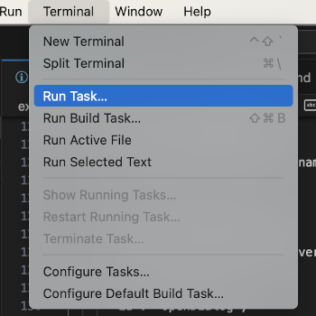
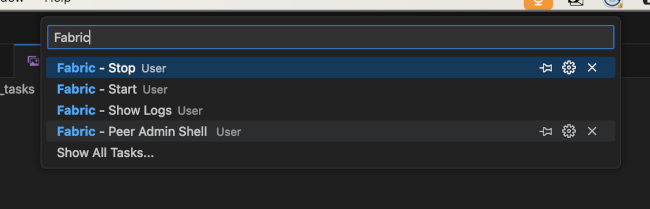
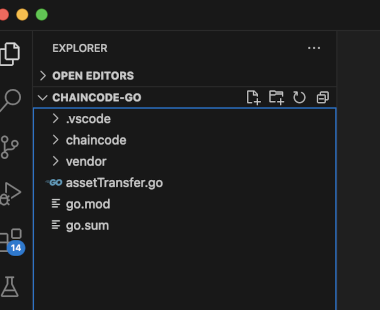
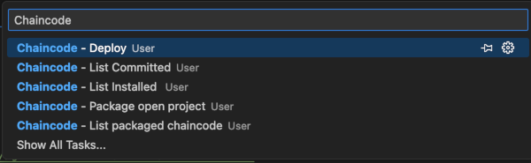
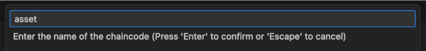
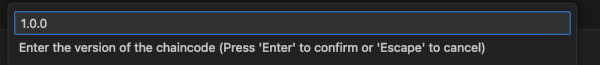
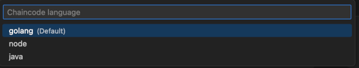
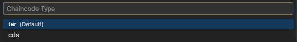
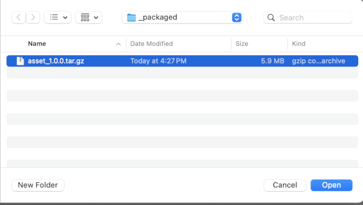

# Microfab VSCode User Tasks

Microfab VSCode User Tasks provides a set of VSCode tasks that allows you to quickly start developing Hyperledger Fabric chaincode. The user tasks provide a "wrapper" for easily calling microfab to package chaincode as well as iteratively deploying chaincode in the microfab container.

The user tasks also provide a way to easily monitor Fabric logs and launch a management shell to directly call Fabric CLI commands.

## Requirements

The user tasks require the following to be installed:

- docker
- "Command Variable" VSCode extension

NOTE: All Fabric binaries are executed from the microfab container, so microfab must be running before running any tasks.

## Installation:

The user tasks depend on a local directory as a storage location for chaincode source as well as scripts and a repository to store packaged chaincode.  This directory is mounted as a docker host volume.  Create a directory on the local machine.

Installation is simply a matter of selecting `Code -> Settings -> User Tasks` from the VSCode menu and pasting in the folling JSON.  Inside the JSON, replace the string "<LOCAL_DIRECTORY>" with the fully qualified path to the created directory.

```
{
  // See https://go.microsoft.com/fwlink/?LinkId=733558
  // for the documentation about the tasks.json format
  "version": "2.0.0",
  "options": {
    "env": {
      "local_directory": "<LOCAL_DIRECTORY>",
      "CORE_PEER_MSPCONFIGPATH": "/working/_msp/Org1/org1admin/msp",
      "CORE_PEER_ADDRESS": "org1peer-api.127-0-0-1.nip.io:8080",
      "CORE_PEER_LOCALMSPID": "Org1MSP"
    }
  },
  "tasks": [
    {
      "label": "Fabric - Start",
      "type": "shell",
      "command": "docker run -d --rm -p 8080:8080 -u microfab -v $local_directory:/working --name microfab ghcr.io/hyperledger-labs/microfab:latest && sleep 8 && cd $local_directory && docker cp microfab:opt/examples/vscode_tasks/_utils $local_directory/_utils  && curl -s http://console.127-0-0-1.nip.io:8080/ak/api/v1/components | npx @hyperledger-labs/weft microfab -w _wallets -p _gateways -m _msp -f",
      "problemMatcher": []
    },
    {
      "label": "Fabric - Stop",
      "type": "shell",
      "command": "docker stop microfab",
      "problemMatcher": []
    },
    {
      "label": "Fabric - Show Logs",
      "type": "shell",
      "command": "docker logs microfab -f",
      "presentation": {
        "echo": true,
        "reveal": "always",
        "focus": false,
        "panel": "new",
        "showReuseMessage": true,
        "clear": false
      },
      "problemMatcher": []
    },
    {
      "label": "Fabric - Peer Admin Shell",
      "type": "shell",
      "command": "docker exec -it -e CORE_PEER_MSPCONFIGPATH=$CORE_PEER_MSPCONFIGPATH -e CORE_PEER_ADDRESS=$CORE_PEER_ADDRESS -e CORE_PEER_LOCALMSPID=$CORE_PEER_LOCALMSPID -w /working microfab bash",
      "problemMatcher": []
    },
    {
      "label": "Chaincode - Package open project",
      "type": "shell",
      "command": "cd $local_directory && rm -rf _chaincode_src && mkdir -p _chaincode_src && mkdir -p _packaged && cp -R ${workspaceFolder} _chaincode_src/temp && docker exec -it microfab /working/_utils/package.sh ${input:chaincodeName} ${input:chaincodeVersion} ${input:language} ${input:chaincodeType} /working/_chaincode_src/temp",
      "problemMatcher": []
    },
    {
      "label": "Chaincode - List packaged chaincode",
      "type": "shell",
      "command": "cd $local_directory && ls _packaged/",
      "problemMatcher": []
    },
    {
      "label": "Chaincode - List Committed",
      "type": "shell",
      "command": "docker exec -it -e CORE_PEER_MSPCONFIGPATH=$CORE_PEER_MSPCONFIGPATH -e CORE_PEER_ADDRESS=$CORE_PEER_ADDRESS -e CORE_PEER_LOCALMSPID=$CORE_PEER_LOCALMSPID microfab peer lifecycle chaincode querycommitted -C channel1",
      "problemMatcher": []
    },
    {
      "label": "Chaincode - List Installed ",
      "type": "shell",
      "command": "docker exec -it -e CORE_PEER_MSPCONFIGPATH=$CORE_PEER_MSPCONFIGPATH -e CORE_PEER_ADDRESS=$CORE_PEER_ADDRESS -e CORE_PEER_LOCALMSPID=$CORE_PEER_LOCALMSPID microfab peer lifecycle chaincode queryinstalled",
      "problemMatcher": []
    },
    {
      "label": "Chaincode - Deploy",
      "type": "shell",
      "command": "docker exec -it -e CORE_PEER_MSPCONFIGPATH=$CORE_PEER_MSPCONFIGPATH -e CORE_PEER_ADDRESS=$CORE_PEER_ADDRESS -e CORE_PEER_LOCALMSPID=$CORE_PEER_LOCALMSPID microfab /working/_utils/deployCC.sh ${input:openDialog}",
      "problemMatcher": []
    }
  ],
  "inputs": [
    {
      "type": "pickString",
      "id": "language",
      "description": "Chaincode language",
      "options": [
        "golang",
        "node",
        "java"
      ],
      "default": "golang"
    },    
    {
      "type": "pickString",
      "id": "chaincodeType",
      "description": "Chaincode Type",
      "options": [
        "tar",
        "cds"
      ],
      "default": "tar"
    },       
    {
      "type": "promptString",
      "id": "chaincodeName",
      "description": "Enter the name of the chaincode"
    },
    {
      "type": "promptString",
      "id": "chaincodeVersion",
      "description": "Enter the version of the chaincode"
    },
    {
      "id": "openDialog",
      "type": "command",
      "command": "extension.commandvariable.file.openDialog",
      "args": {
        "canSelect": "files",
        "defaultUri": "<LOCAL_DIRECTORY>/_packaged",
        "transform": {
          "text": "${fileBasename}"
        },  
      }
    }
  ]
} 
```

## Working Directory Contents

The local working directory has the following structure:

```
├── _chaincode_src
├── _gateways
├── _msp
├── _packaged
├── _utils
└── _wallets
```

The folders _gateways, _msp and _wallets are created by microfab and contain the connection information for the Fabric network.  The _chaincode_src directory is a temp directory to host the chaincode to be packaged.   The process to package a chaincode is to make a make a copy of the source to the _chaincode_src directory.  This is to make the source "visible" to the peer CLI from the microfab container.  The _packaged directory is the target directory for storing packaged chaincode.  The _utils directory contains scripts to deploy chaincode to microfab.


## Start the microfab container

The microfab instance can be started by selecting `Terminal -> Run Task` in VSCode:



Type `Fabric` into the task filter to show the list of Fabric tasks.



Select `Fabric - Start`.

This will start the microfab container, download utilties and connection information to the local machine.

```
Executing task: docker run -d --rm -p 8080:8080 -u microfab -v $local_directory:/working --name microfab microfab:latest && sleep 8 && cd $local_directory && docker cp microfab:opt/examples/vscode_tasks/_utils $local_directory/_utils  && curl -s http://console.127-0-0-1.nip.io:8080/ak/api/v1/components | npx @hyperledger-labs/weft microfab -w _wallets -p _gateways -m _msp -f 

ea46ace0571b304ab578ad2103df44ec2758b397bf8592c1f9b32208ab58b6ea
Successfully copied 34.3kB to /opt/fabric/dev/_utils
Gateway profile written to : /opt/fabric/dev/_gateways/org1gateway.json 
Added identity under label ordereradmin to the wallet at /opt/fabric/dev/_wallets/Orderer 
Added identity under label org1admin to the wallet at /opt/fabric/dev/_wallets/Org1 
Added identity under label org1caadmin to the wallet at /opt/fabric/dev/_wallets/Org1 

Environment variables: 
{"mspid":"Org1MSP","peers":["org1peer-api.127-0-0-1.nip.io:8080"],"ids":{"org1admin":"/opt/fabric/dev/_msp/Org1/org1admin/msp","org1caadmin":"/opt/fabric/dev/_msp/Org1/org1caadmin/msp"},"tlsrootcert":""} 

For org1admin @  Org1 use these:
 
export CORE_PEER_LOCALMSPID=Org1MSP
export CORE_PEER_MSPCONFIGPATH=/opt/fabric/dev/_msp/Org1/org1admin/msp
export CORE_PEER_ADDRESS=org1peer-api.127-0-0-1.nip.io:8080

For org1caadmin @  Org1 use these:
 
export CORE_PEER_LOCALMSPID=Org1MSP
export CORE_PEER_MSPCONFIGPATH=/opt/fabric/dev/_msp/Org1/org1caadmin/msp
export CORE_PEER_ADDRESS=org1peer-api.127-0-0-1.nip.io:8080
Complete 
```

## Packaging Chaincode

Open a chaincode project in VSCode.  The chaincode folder must be the top level folder in VSCode:



The chaincode should be complete with all vendoring if required before packaging.

Note: The microfab container must be running.

The microfab instance can be started by selecting `Terminal -> Run Task` in VSCode:


Type `Chaincode` into the task filter to show the list of Fabric tasks for Chaincode.



Select `Chaincode - Package open project`

Enter a name for the chaincode:



Enter a version for the chaincode:



Select the language for the chaincode:



Select the package type for the chaincode:



The packaged chaincode will be copied to the `_packaged` directory in the local working directory.

## Deploy Chaincode

The packaged chaincode can be deployed by selecting `Terminal -> Run Task` in VSCode:

Type `Chaincode` into the task filter to show the list of Fabric tasks for Chaincode.


Select `Chaincode - Deploy`



Note:  `Fabric - Show Logs` can be used to show the peer logs as the chaincode lifecycle process is completed.

```
Chaincode definition committed on channel 'channel1'
Querying chaincode definition on org1peer on channel 'channel1'...
Attempting to Query committed status on org1peer, Retry after 3 seconds.
+ peer lifecycle chaincode querycommitted --channelID channel1 --name asset
+ res=0
Committed chaincode definition for chaincode 'asset' on channel 'channel1':
Version: 1.0.0, Sequence: 1, Endorsement Plugin: escc, Validation Plugin: vscc, Approvals: [Org1MSP: true]
Query chaincode definition successful on org1peer on channel 'channel1'
```

## List Packaged Chaincode

Packaged chaincodes can be shown by running `Terminal -> Run Task -> Chaincode - List packaged chaincode`

Example:

```
Executing task: cd $local_directory && ls _packaged/ 

asset_1.0.0.tar.gz
```

## List Installed Chaincode

Installed chaincodes can be shown by running `Terminal -> Run Task -> Chaincode - List installed`

Example:

```
Executing task: docker exec -it -e CORE_PEER_MSPCONFIGPATH=$CORE_PEER_MSPCONFIGPATH -e CORE_PEER_ADDRESS=$CORE_PEER_ADDRESS -e CORE_PEER_LOCALMSPID=$CORE_PEER_LOCALMSPID microfab peer lifecycle chaincode queryinstalled 

Installed chaincodes on peer:
Package ID: asset_1.0.0:65584e9a39a9b57053db44c30e1b20f727e4c9798effc5dc69c2e4530954f703, Label: asset_1.0.0
```

## List Commited Chaincode

Committed chaincodes can be shown by running `Terminal -> Run Task -> Chaincode - List Committed`

Example:

```
Executing task: docker exec -it -e CORE_PEER_MSPCONFIGPATH=$CORE_PEER_MSPCONFIGPATH -e CORE_PEER_ADDRESS=$CORE_PEER_ADDRESS -e CORE_PEER_LOCALMSPID=$CORE_PEER_LOCALMSPID microfab peer lifecycle chaincode querycommitted -C channel1 

Committed chaincode definitions on channel 'channel1':
Name: asset, Version: 1.0.0, Sequence: 1, Endorsement Plugin: escc, Validation Plugin: vscc
```

## Peer Admin Shell

A peer admin shell with necessary environment varibles and certificates launched by running `Terminal -> Run Task -> Fabric - Peer Admin Shell`

Example:

```
Executing task: docker exec -it -e CORE_PEER_MSPCONFIGPATH=$CORE_PEER_MSPCONFIGPATH -e CORE_PEER_ADDRESS=$CORE_PEER_ADDRESS -e CORE_PEER_LOCALMSPID=$CORE_PEER_LOCALMSPID --workdir=/working microfab bash 

microfab@ea46ace0571b:/working$ 
```

Show the working directory contents:

```
microfab@ea46ace0571b:/working$ ls
_chaincode_src  _gateways  _msp  _packaged  _utils  _wallets
microfab@ea46ace0571b:/working$ 
```

#### List channels the peer has joined:

```
microfab@ea46ace0571b:/working$ peer channel list
2024-06-11 15:47:02.805 UTC 0001 INFO [channelCmd] InitCmdFactory -> Endorser and orderer connections initialized
Channels peers has joined: 
channel1
```

#### List channels committed chaincode for the peer and channel:

```
Executing task: docker exec -it -e CORE_PEER_MSPCONFIGPATH=$CORE_PEER_MSPCONFIGPATH -e CORE_PEER_ADDRESS=$CORE_PEER_ADDRESS -e CORE_PEER_LOCALMSPID=$CORE_PEER_LOCALMSPID microfab peer lifecycle chaincode querycommitted -C channel1 

Committed chaincode definitions on channel 'channel1':
Name: asset, Version: 1.0.0, Sequence: 1, Endorsement Plugin: escc, Validation Plugin: vscc
Name: asset-transfer-basic-go, Version: 1.0.0, Sequence: 1, Endorsement Plugin: escc, Validation Plugin: vscc
```

#### Invoke chaincode 

This example assumes you have built and deployed the fabric sample, asset-transfer-basic:

peer chaincode invoke -o orderer-api.127-0-0-1.nip.io:8080 -C channel1 -n asset-transfer-basic-go -c '{"Args":["CreateAsset","1","blue","35","tom","1000"]}' --waitForEvent 

```
microfab@ea46ace0571b:/working$ peer chaincode invoke -o orderer-api.127-0-0-1.nip.io:8080 -C channel1 -n asset-transfer-basic-go -c '{"Args":["CreateAsset","1","blue","35","tom","1000"]}' --waitForEvent 
2024-06-11 17:19:32.237 UTC 0001 INFO [chaincodeCmd] ClientWait -> txid [9b3bbfd69e3217800aa5f94f1a6479e19c990c6ea13847d027317e3ee4dd5bd3] committed with status (VALID) at org1peer-api.127-0-0-1.nip.io:8080
2024-06-11 17:19:32.240 UTC 0002 INFO [chaincodeCmd] chaincodeInvokeOrQuery -> Chaincode invoke successful. result: status:200 
```

#### Query chaincode 

peer chaincode query -C channel1 -n asset-transfer-basic-go -c '{"Args":["ReadAsset","1"]}'

```
microfab@ea46ace0571b:/working$ peer chaincode query -C channel1 -n asset -c '{"Args":["ReadAsset","1"]}'
{"AppraisedValue":1000,"Color":"blue","ID":"1","Owner":"tom","Size":35}
```